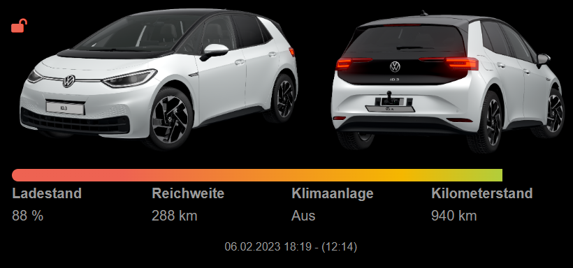
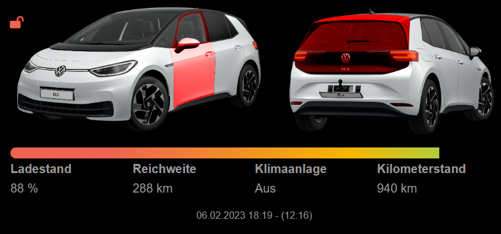
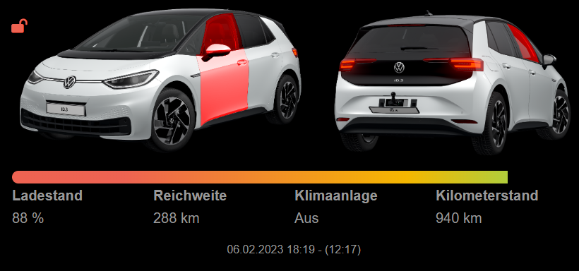
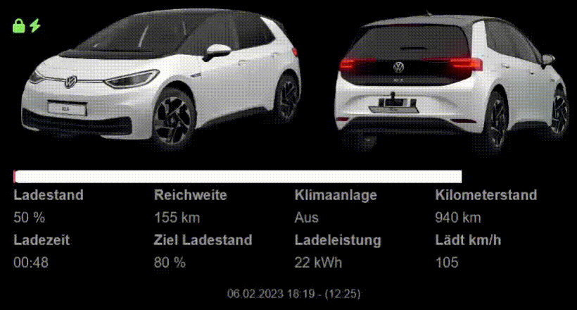

[](https://github.com/NikolasRupp/MMM-weconnectid-alt/blob/master/LICENSE)

# MMM-weconnectid

A module to integrale informations from  [We Connect ID](https://www.volkswagen.de/de/besitzer-und-nutzer/myvolkswagen.html) into the [MagicMirror](https://github.com/MichMich/MagicMirror).

- [Alternative](#alternative)
- [Usage](#usage)
- [Tested with](#tested-with)
- [Pictures](#pictures)

## I currently don't have a MM so notify me when something is not working. Feel free to send an merge request.

## Alternative
This Module:

Advantage:
- Works with every Python Version

Disadvantage:
- No Pictures of your own car (Always a white ID.3)
- No Location of the Car

[Alternative Module](https://github.com/NikolasRupp/MMM-weconnectid):

Advantage:
- Will use the Pictures provided by the API
- Location of your Car

Disadvantage:
- Only works with Python 3.9 or higher

## Usage

### Installation

- You have to register your VW ID at [MyVolkswagen](https://www.volkswagen.de/de/besitzer-und-nutzer/myvolkswagen.html) and have a valid WE Connect ID subscription

- You need Python to connect to the Api. You can have a look [here](https://raspberrytips.com/install-latest-python-raspberry-pi/) on how to install it. Short it works like this, but normally you should already have python2 and/or python3 installed by default, so you normally don't need to install it:

```
cd ~
wget https://www.python.org/ftp/python/3.9.15/Python-3.9.15.tgz
tar -zxvf Python-3.9.15.tgz
cd Python-3.9.15
./configure --enable-optimizations
sudo make altinstall
```

- To use this module, clone this repository to your __modules__ folder of your MagicMirror:

```
cd ~/MagicMirror/modules
git clone https://github.com/NikolasRupp/MMM-weconnectid-alt.git
```

- Now just add the module to your config.js file ([config entries](#configuration)).

### Configuration

The module needs the default configuration block in your config.js to work.

```javascript
{
  module: 'MMM-weconnectid',
  position: "top_left",
  config: {
    username: "",
    password: "",
    vin: "",
    fields: '{"SOC":"remainingSoC","RANGE":"remainingKm","CLIMATE":"climatisation","ODOMETER":"odometer","LOADING TIME":"remainingTime","TARGET SOC":"targetSoC","LOADING POWER":"chargePower","KMPH":"chargekmph"}',
    fields_charging : ["LOADING TIME","TARGET SOC","LOADING POWER","KMPH"],
    number: 4,
    python: "python3",
    maxHeight: "300px",
    maxWidth: "800px",
    remainingSOCyellow: 70,
    remainingSOCred: 20,
    barstyle: "fluent",
    updateFrequency: 600000,
    timestamp: true,
  }
},
```

The following properties can be configured:

|Option|Description|Options|Default|Required|Type|
|---|---|---|---|---|---|
|username|Your Login E-Mail|-|-|yes|Text|
|password|Your Login Password|-|-|yes|Text|
|vin|The VIN of your Vehicle|-|-|yes|Text|
|fields|Fields that should be shown [More Information](#fields)|-|'{"SOC":"remainingSoC","RANGE":"remainingKm","CLIMATE":"climatisation","ODOMETER":"odometer","LOADING TIME":"remainingTime","TARGET SOC":"targetSoC","LOADING POWER":"chargePower","KMPH":"chargekmph","POSITION":"position"}'|no|Text|
|fields_charging|Fields that should be shown during charging [More Information](#fields)|-|["LOADING TIME","TARGET SOC","LOADING POWER","KMPH"]|no|List|
|number|Number of fields in each row|Any Number|4|no|Number|
|python|Python u want to use|Any Python higher than 3.9|"python3"|no|Text|
|maxHeight|Max Height of the Pictures|Any px or % value|"300px"|no|Text|
|maxWidth|Max Width of the Pictures|Any px or % value|"800px"|no|Text|
|remainingSOCyellow|Percentage when the Progress Bar of the Battery should be yellow|0-100|70|no|Number|
|remainingSOCred|Percentage when the Progress Bar of the Battery should be red|0-100|20|no|Number|
|barstyle|Style of the Progress Bar|"fluent", "strict"|"fluent"|no|Text|
|updateFrequency|Update Frequency|Any Value|600000|no|Number|
|timestamp|If the Timestamp should be shown. It shows the Date and time when the last update from the car was sent to the VW Server and the Time of the last Update of the Widget|true, false|true|no|Boolean|

#### Fields

You can define which fields you want to see. The Format hast to be valid Json.
The key will be used as the Header in the Table. You can Name that whatever you like. If you name them like in the default they will be translated vie the translation file.

The following Attributes are available:

|Value|Description|
|---|---|
|bonnetDoor|Status of the Bonnet Door (Will also be shown in the Image, so not really necessary)|
|trunkDoor|Status of the Trunk Door (Will also be shown in the Image, so not really necessary)|
|frontLeftDoor|Status of the Front Left Door (Will also be shown in the Image, so not really necessary)|
|frontRightDoor|Status of the Front Right Door (Will also be shown in the Image, so not really necessary)|
|rearLeftDoor|Status of the Rear Left Door (Will also be shown in the Image, so not really necessary)|
|rearRightDoor|Status of the Rear Right Door (Will also be shown in the Image, so not really necessary)|
|overallStatus|If the Vehicle is locked (Will also be shown in the Image, so not really necessary)|
|frontLeftWindow|Status of the Front Left Window (Will also be shown in the Image, so not really necessary)|
|frontRightWindow|Status of the Front Right Window (Will also be shown in the Image, so not really necessary)|
|rearLeftWindow|Status of the Rear Left Window (Will also be shown in the Image, so not really necessary)|
|rearLRightWindow|Status of the Rear Right Window (Will also be shown in the Image, so not really necessary)|
|chargePower|Current Charging Power in kWh|
|chargingState|Current Charging State|
|remainingSoC|Remaining SoC in %|
|remainingTime|Remaining Charging Time in h:mm|
|remainingKm|Remaining km|
|targetSoC|Target SoC in %|
|chargekmph|Charging ... km/h|
|leftLight|Status of left Light|
|rightLight|Status of Right Light|
|odometer|Odometer in km|
|climatisation|Status of Climatisation (Will show the selected Temperature in °C if On|

If you want, that some Values like the remaining charging time will only be displayed during charging you can add the header to the list of the fields_charging Parameter.

## Tested with
- Volkswagen ID.3 Modelyear 2023

## Pictures
Fluent Progress Bar


Strict Progress Bar


Normal View


Unlocked Car


Open Door and Trunk


Open Door and Windows


Charging View

